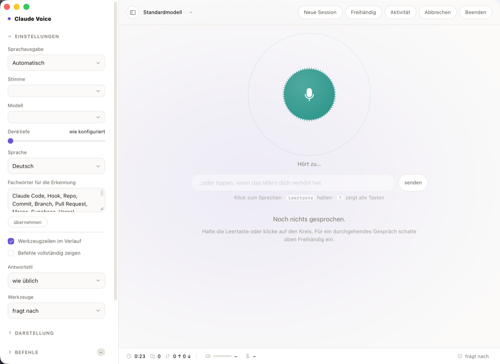

# claude-voice

Mit Claude Code reden statt tippen — auf macOS, mit lokaler Spracherkennung.

Vier Wege, die sich dieselbe Konfiguration, dieselbe Session und dieselbe
Sprachausgabe teilen:

| | was es tut |
|---|---|
| **Claude Voice.app** | Eigenes Fenster. ⌥Leertaste holt es von überall nach vorn und nimmt auf, ein Symbol in der Menüleiste hält es erreichbar. |
| **`claude-voice-ui`** | Dieselbe Oberfläche im Browser, falls du sie lieber in einem Tab hast. |
| **`claude-voice`** | Im Terminal: reden, kurz Pause, Antwort kommt gesprochen zurück. |
| **Vorlese-Hook** | Claude Code liest jede fertige Antwort vor. Du tippst weiter wie immer. |

Die Spracherkennung läuft komplett lokal über [whisper.cpp](https://github.com/ggerganov/whisper.cpp).
Nur der fertig transkribierte Text geht an die Claude-API — Audio verlässt den Rechner nie.



## Installation

```bash
git clone <dieses-repo> ~/claude-voice
cd ~/claude-voice && ./install.sh
```

`install.sh` prüft die Abhängigkeiten, legt Symlinks nach `~/.claude`, kopiert die
Beispielkonfiguration, lädt auf Wunsch das Whisper-Modell (~547 MB) und registriert
den Stop-Hook in `settings.json`. Nichts wird überschrieben, was schon existiert.

Abhängigkeiten: `brew install whisper-cpp sox ffmpeg jq`. Die Oberfläche braucht
zusätzlich Node; `claude-voice-ui` holt beim ersten Start das Agent SDK und baut
die Oberfläche (React, TypeScript, Tailwind) — beides einmalig und automatisch.

Danach `~/.claude/bin` in den PATH und `~/.claude/hooks/voice on`.

## Desktop-App

Die App ist eine Tauri-Schale um denselben lokalen Server. Sie bringt, was ein
Browser-Tab nicht kann: einen globalen Kurzbefehl (⌥Leertaste, holt das Fenster
nach vorn und startet die Aufnahme), ein Symbol in der Menüleiste, und
Mikrofonzugriff ohne Erlaubnisfrage je Herkunft.

Fertige DMG unter [Releases](../../releases). Selbst bauen:

```bash
cd desktop && npx tauri build      # braucht Rust: https://rustup.rs
```

**Zur Gatekeeper-Warnung.** Die DMG ist nur ad-hoc signiert — es gibt kein
Apple-Developer-Zertifikat dahinter. macOS meldet deshalb beim ersten Öffnen
„beschädigt und kann nicht geöffnet werden". Das ist kein Befund über die
Datei, sondern die Voreinstellung für alles Unsignierte aus dem Netz. Einmalig:

```bash
xattr -dr com.apple.quarantine "/Applications/Claude Voice.app"
```

Wem das zu weit geht: selbst bauen. Dann entsteht die App lokal und trägt gar
kein Quarantäne-Merkmal.

Die App bringt den Server nicht mit — sie sucht `server.mjs` dort, wo
`install.sh` ihn hinlegt. Ohne die Installation startet sie mit einem Hinweis
statt mit einem leeren Fenster.

## Benutzung

```bash
claude-voice              # Freisprech-Loop, neue Session
claude-voice --last       # letzte Voice-Session fortsetzen
claude-voice --yolo       # Tools ohne Rückfrage (bypassPermissions)

claude-voice-ui           # Oberfläche im Browser, 127.0.0.1:7331
claude-voice-ui --port N

~/.claude/hooks/voice on|off|toggle|stop|test|voices|status
```

Im Terminal-Loop beendet „stopp" oder Ctrl-C. In der Oberfläche: Klick oder
Leertaste halten zum Sprechen, **Esc** hält den laufenden Zug samt Sprachausgabe
an, „Beenden" fährt den Server herunter. In der App holt ⌥Leertaste das Fenster
von überall nach vorn und startet die Aufnahme.

Alle drei Wege halten **eine** Agent-Session offen, statt pro Äußerung einen
neuen Prozess zu starten. Gemessen kostete allein der Prozessstart früher rund
13 Sekunden je Satz. Was die offene Session bringt:

- **Antwort in ~2 s statt ~13 s.**
- **Text läuft mit,** während er entsteht; jeder fertige Satz geht sofort in die
  Sprachausgabe, statt auf die komplette Antwort zu warten.
- **Freigaben.** Will Claude ein Werkzeug benutzen, das eine Bestätigung braucht,
  hält der Zug an. In der Oberfläche erscheint eine Karte mit Werkzeugname und
  Parametern, im Terminal eine Frage mit j/n, die zusätzlich vorgelesen wird.
  In der Oberfläche lässt sich eine Freigabe auf „immer dieser Aufruf" oder
  „immer dieses Werkzeug" ausweiten — für die laufende Session.

Unter **Einstellungen** liegen Sprachausgabe, Stimme, Modell, Sprache und
Berechtigungen. Modell und Berechtigungen gelten sofort für die laufende
Session; eine Sprachumstellung startet sie neu, weil die Antwortsprache am
Systemprompt hängt und der je Session fest ist. Die Spracherkennung stellt
ohne Neustart um.

**Verlauf** listet frühere Sessions aus diesem Verzeichnis; ein Klick setzt
eine davon fort.

Der Berechtigungsmodus lässt sich auch direkt umschalten und gilt sofort für die
laufende Session — von „fragt nach" bis „ohne jede Rückfrage". Letzteres wird
rot dargestellt, weil es jede Bestätigung abschaltet.

Der Server verlangt ein Token, das beim Start erzeugt und in die geöffnete URL
gehängt wird. Ohne das könnte jede Webseite, die du im selben Browser offen hast,
die Endpunkte auslösen — „nur localhost" schützt davor nicht.

## Sprachausgabe

Alles spricht über `bin/claude-say`. Drei Backends, umschaltbar per `TTS_BACKEND`
in der Konfig oder `--tts` beim Start:

| Backend | Erzeugung | Kosten | Anmerkung |
|---|---|---|---|
| `elevenlabs` | ~1,1 s | Credits | beste Qualität, braucht Netz und Key |
| `edge` | ~0,5 s | – | Microsoft-Neural-Stimmen, kostenlos, ohne Key. **Nicht lokal** — geht über einen undokumentierten Endpunkt |
| `piper` | ~0,7 s | – | lokal und offline, hörbar synthetischer |
| `say` | sofort | – | macOS-Systemstimme, sprödeste Qualität |

`auto` (Default) nimmt ElevenLabs wenn ein Key da ist, sonst Edge, Piper, `say`.
In der Oberfläche lassen sich Backend und Stimme umschalten; was nicht
eingerichtet ist, erscheint ausgegraut mit dem Grund daneben.
Ein fehlschlagendes Backend fällt immer auf `say` zurück — Stille wäre die
schlechteste Antwort, wenn man auf eine Sprachausgabe wartet.

```bash
claude-voice --tts piper
claude-voice-ui --tts piper
claude-say --backends        # was ist verfügbar und aktiv
claude-say --tts edge --voice de-DE-ConradNeural "Text"
```

Warum nicht Kokoro, MLX Audio, Kimi oder Gemma: [docs/tts-evaluation.md](docs/tts-evaluation.md).

**Edge einrichten** (kostenlos, kein Key):

```bash
uv tool install edge-tts
edge-tts --list-voices | grep ^de-
```

**Piper einrichten** (lokal, kostenlos):

```bash
uv tool install piper-tts
mkdir -p ~/.claude/piper-voices && cd ~/.claude/piper-voices
B=https://huggingface.co/rhasspy/piper-voices/resolve/main/de/de_DE
curl -fLO $B/thorsten/medium/de_DE-thorsten-medium.onnx
curl -fLO $B/thorsten/medium/de_DE-thorsten-medium.onnx.json
```

Andere deutsche Stimmen liegen unter `de/de_DE/` im selben Repository
(kerstin, eva_k, karlsson, pavoque, ramona), Pfad dann in `PIPER_MODEL` eintragen.

**ElevenLabs einrichten:** Liegt ein Key vor, wird er genutzt.

```bash
security add-generic-password -a "$USER" -s elevenlabs-api-key -w
claude-say --doctor     # Key gegen die API prüfen
claude-say --list       # verfügbare Stimmen und Modelle des Accounts
```

Alternativ die Umgebungsvariable `ELEVENLABS_API_KEY`.

## Konfiguration

`~/.claude/voice.conf` gilt überall, `~/.claude/voice-loop.conf` überschreibt sie
für alle Wege. Siehe `conf/*.example` für alle Schalter. Die wichtigsten:

- `CLAUDE_MODEL` — leer heißt dein Default. Für ein Gespräch ist ein schnelleres
  Modell oft angenehmer als das stärkste.
- `SILENCE_SEC` — wie lange Stille die Aufnahme beendet. Höher, wenn dir der Loop
  beim Nachdenken ins Wort fällt.
- `MIN_DUR` — kurze Einwürfe wie „ja" werden sonst als Husten verworfen.
- `VOCAB` — Fachwörter, auf die Whisper vorgespannt wird. Ohne das wird aus
  „Stop Hook" gern „Stopthook".

## Wie es zusammenhängt

```
Terminal:  Mikro ─> sox rec ─> whisper.cpp ─> agent-loop.mjs ──┬─> claude-say ─> 🔈
                    (Stille)    (lokal)       (offene Session) └─> Frage j/n

Fenster:   Mikro ─> Webview ─> whisper-server ─> server.mjs ───┬─> claude-say ─> 🔈
                                (Modell bleibt   (offene       │   (satzweise)
                                 geladen)         Session)     └─> Freigabe-Karte
```

Die App ist eine Tauri-Schale um denselben `server.mjs`: sie startet ihn als
Kindprozess auf einem freien Port und lädt ihn ins Fenster. Der Agent SDK ist
TypeScript-only, also bleibt der Server, wo er ist — Rust bringt nur, was ein
Browser-Tab nicht kann.

Der Terminal-Loop spricht über zwei benannte Pipes mit `ui/agent-loop.mjs`,
einer Zeile JSON je Ereignis. Dadurch hat auch er eine offene Session, Freigaben
und satzweise Sprachausgabe.

Terminal und Fenster melden sich für ihre Laufzeit in `~/.claude/voice-locks/` an (eine Datei
pro PID). Der Stop-Hook schweigt, solange dort ein lebender Prozess steht — sonst
spräche jede Antwort doppelt. Tote Einträge nach einem Absturz werden beim nächsten
Blick aufgeräumt, und zwei parallele Instanzen melden sich nicht gegenseitig ab.

Antworten sind über den Systemprompt auf drei bis vier Sätze ohne Markdown
begrenzt — vorgelesene Codeblöcke sind unbrauchbar. In der Oberfläche lässt sich
darüber hinaus ein Antwortstil wählen (knapp, ausführlich, erklärend, sachlich,
locker, sokratisch, oder ein selbst formulierter).

## Bekannte Grenzen

- Nur macOS (`say`, `afplay`, sox-Aufnahme über CoreAudio, die App ist ein
  Cocoa-Bündel).
- Kein Wake-Word. Der Freisprech-Modus nimmt auf, sobald es laut genug wird.
- Die Schwellwerte der Sprachaktivitätserkennung sind geschätzt, nicht mit einer
  echten Stimme gemessen. Zur Laufzeit verstellbar über
  `__voice.tune({ startSec, endSec })`.
- Der Server bindet nur an `127.0.0.1` und verlangt ein Token, weil seine
  Endpunkte Claude mit Werkzeugzugriff starten. Nicht ins Netz stellen.
- Die DMG ist ad-hoc signiert, kein Apple-Zertifikat. Siehe oben zur
  Gatekeeper-Warnung.

## Tests

```bash
tests/smoke.sh          # alles: Skripte, Bau, Einheitentests, Rust
node --test tests/      # nur die Einheitentests des Servers
cd app && node --test src/logik.test.ts
```

`tests/smoke.sh` deckt die Fehlerklassen ab, die beim Bauen wirklich
zugeschlagen haben: bash-3.2-Syntax, Argument-Parsing, Vorrang der
Konfigquellen, Lock-Verhalten, Uebersetzungsluecken. Die Einheitentests
pruefen die reine Logik — die Zustandsmaschine der Oberflaeche, die
Transkript-Auswertung, die Textaufbereitung fuers Vorlesen.

Was hier nicht geprueft werden kann: alles, was ein Mikrofon, das Whisper-Modell
oder eine angemeldete `claude`-CLI braucht. Diese Grenze ist echt — ein gruener
Durchlauf heisst nicht, dass gesprochen werden kann.

GitHub Actions laesst dasselbe auf einem frischen Klon laufen. Genau das ist
der Zweck: auf dem Entwicklungsrechner liegen `node_modules`, `dist` und die
Rust-Toolchain schon herum, dort laeuft alles auch dann, wenn im Repo etwas
fehlt.
